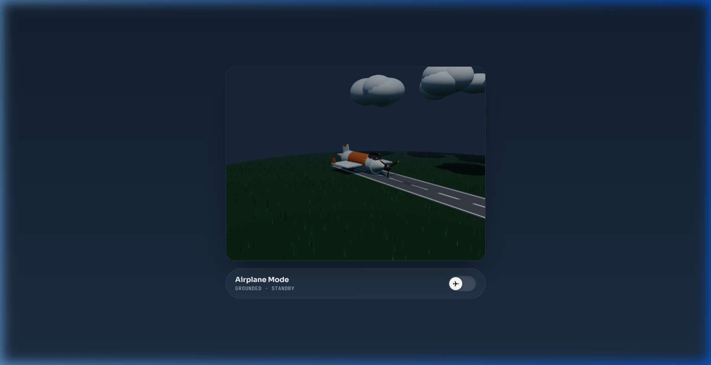
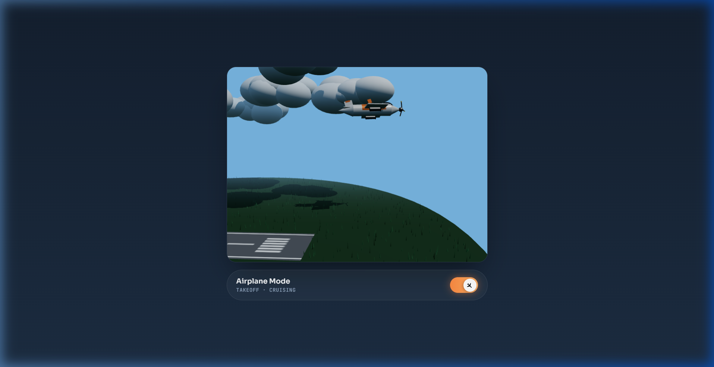

<div align="center">

# ✈️ AIRPLANE MODE · 3D TOGGLE

<p align="center">
  <b>A cinematic, real-time 3D Airplane Mode UI micro-interaction built with React 19, Three.js & Vite</b>
</p>

[](https://react.dev/)
[](https://vitejs.dev/)
[](https://threejs.org/)
[](LICENSE)

---

</div>

## 📸 UI Previews

<div align="center">

| 🛬 GROUNDED · STANDBY | 🛫 TAKEOFF · CRUISING |
| :---: | :---: |
|  |  |

</div>

---

## 🌟 Overview

**Airplane Mode 3D** is an interactive, high-end web experience that elevates a standard device toggle switch into a cinematic 3D flight simulation sequence. 

When activated, a procedurally rendered modern turboprop aircraft accelerates down an asphalt runway, pitches up into a climb, retracts its landing gear, spins its 3-blade propeller at high velocity, and ascends smoothly into a dynamic dusk-to-day sky transition.

```
       _____                      
      /  ___|   _   _   ___   _   
      | |___  | | | | / _ \ | |  
      \___  | | |_| |  __/  |_|  
      ____| | \__, | \___|  (_)  
     |______/ |___/              
      TAKEOFF · CRUISING MODE
```

---

## ✨ Key 3D Features & Visual Highlights

- **🛩️ High-Fidelity Procedural Aircraft**:
  - Aerodynamic fuselage with chrome nose spinner tip.
  - Tinted glass canopy with realistic specular glass highlights.
  - Swept wings with wingtip winglets and wing root fairings.
  - Twin under-wing turboprop engines with intake nacelle rings.
  - Tail assembly featuring a vertical fin with top accent stripe and horizontal elevators.
  - 3-blade propeller with yellow safety tips (`propGroup`).
  - Tricycle landing gear with hydraulic struts and rubber tires (`gearGroup`).

- **☁️ Volumetric Soft Cloud Clusters**:
  - Multi-layered atmospheric cloud formations built from overlapping smooth sphere geometries with natural diffuse shading.
  - Continuous horizontal drift across flight background.

- **🌾 Multi-Tone Instanced Grass Field**:
  - High-performance rendering of 2,200 grass blades using `THREE.InstancedMesh`.
  - Individual instance color variations (`#386341`, `#43754d`, `#2e5235`, `#4c8257`) creating rich terrain texture.

- **🛣️ High-Resolution Asphalt Runway**:
  - $256 \times 1024$ procedural canvas texture featuring asphalt grain, border thresholds, piano key entry bars, dashed centerlines, and touchdown skid marks.

- **🌅 Cinematic Sky & Lighting System**:
  - Real-time lighting lerp (`HemisphereLight`, `DirectionalLight` with $2048 \times 2048$ soft shadow map).
  - Sky background and fog transition smoothly from deep dusk (`#192537`) to bright day (`#79b7e3`).
  - Soft radial gradient contact shadow tracking aircraft position and height.

- **⚙️ Takeoff Physics & Easing**:
  - Cubic easing (`easeInOutCubic`) controlling acceleration, pitch elevation ($\theta_x$), roll ($\theta_z$), scale reduction, and camera tracking.

- **🎨 Glassmorphic Control Panel**:
  - Translucent UI bar with glowing neon status indicators (`GROUNDED · STANDBY` / `TAKEOFF · CRUISING`) and animated toggle knob.

- **🧹 Zero-Leak Memory Disposal**:
  - Full WebGL scene traversal disposing geometries, textures, and materials on unmount.

---

## 🗂️ Project Directory Structure

```ascii
AirplaneMode/
├── 📁 docs/                 # UI Preview Screenshots
│   ├── 🖼️ preview_grounded.png
│   └── 🖼️ preview_takeoff.png
├── 📁 node_modules/         # Node dependencies
├── 📁 src/                  # Application source
│   ├── 📁 components/       # 3D Components
│   │   └── ✈️ AirplaneModeToggle.jsx   # 3D WebGL Canvas & Toggle UI Logic
│   ├── ⚛️ App.jsx           # Root Component
│   ├── 🎨 index.css         # Design Tokens & UI Styles
│   └── 🚀 main.jsx          # Entry Point
├── 📄 .gitignore            # Git ignore specification
├── 📄 .oxlintrc.json        # Oxlint linter configuration
├── 📄 index.html            # HTML Shell
├── 📄 package.json          # Dependency list & scripts
├── 📄 package-lock.json     # Locked dependency tree
├── 📄 README.md             # Project documentation
└── ⚡ vite.config.js        # Vite build configuration
```

---

## 🛠️ Tech Stack Matrix

| Layer | Technology | Version | Purpose |
| :--- | :--- | :--- | :--- |
| **Framework** | [React](https://react.dev/) | `^19.2.8` | Component state & lifecycle |
| **3D Graphics** | [Three.js](https://threejs.org/) | `^0.185.1` | WebGL scene, lighting, meshes, & shaders |
| **Build Tool** | [Vite](https://vitejs.dev/) | `^8.2.0` | High-speed dev server & production bundler |
| **Styling** | Vanilla CSS3 | Custom Tokens | Sora & JetBrains Mono fonts, glassmorphism |
| **Linter** | [Oxlint](https://oxc.rs/) | `^1.75.0` | High-speed JavaScript linting |

---

## 🚀 Getting Started

### Prerequisites

Ensure you have [Node.js](https://nodejs.org/) (v18.0.0 or higher) installed.

### Installation & Run

1. **Clone the repository:**
   ```bash
   git clone https://github.com/Yuvi4242/Airplane_modeUI.git
   cd Airplane_modeUI
   ```

2. **Install dependencies:**
   ```bash
   npm install
   ```

3. **Start local development server:**
   ```bash
   npm run dev
   ```
   Open `http://localhost:5173` in your browser.

---

## 📜 NPM Commands

| Command | Action |
| :--- | :--- |
| `npm run dev` | Starts Vite HMR dev server |
| `npm run build` | Builds optimized production bundle in `dist/` |
| `npm run preview` | Previews local production build |
| `npm run lint` | Runs `oxlint` static code analysis |

---

## 🔬 Animation Physics & Formulas

The takeoff progression is driven by an interpolated progress variable $p \in [0, 1]$ using cubic easing:

$$f(t) = \begin{cases} 4t^3 & \text{if } t < 0.5 \\ 1 - \frac{(-2t + 2)^3}{2} & \text{if } t \ge 0.5 \end{cases}$$

- **Ground Phase ($p < 0.35$):** Runway roll, propeller acceleration.
- **Climb Out ($p \ge 0.35$):** Pitch rotation ($\theta_x \to -0.28\text{ rad}$), altitude lift off, landing gear retraction ($\text{scale} \to 0$), camera tracking, and sky dusk-to-day transition.

---

## 📄 License

Distributed under the **MIT License**.

<div align="center">

---
Crafted with ❤️ using **React 19** & **Three.js**

</div>
